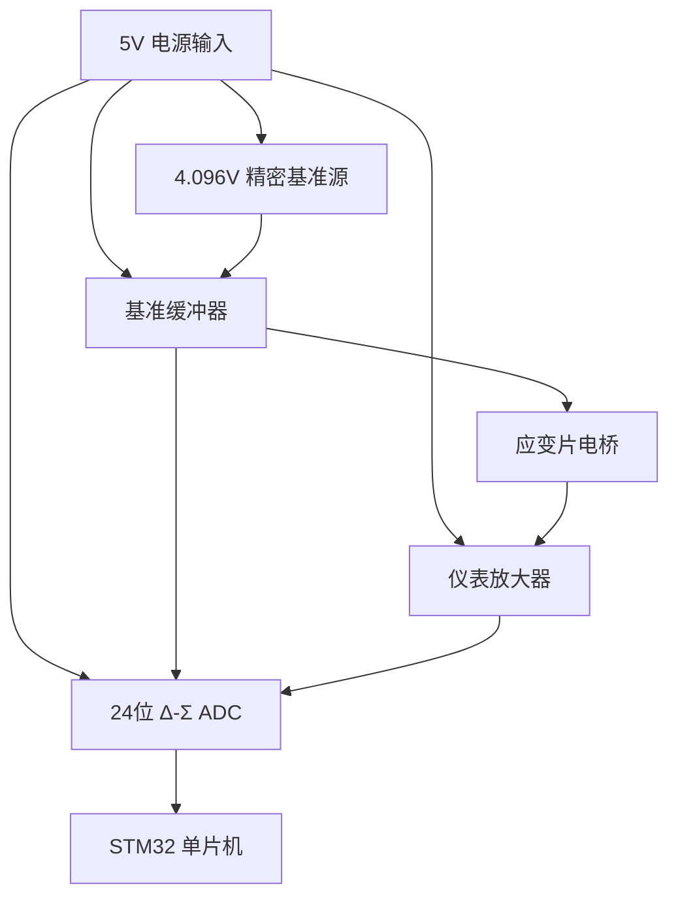

# 项目日志

## step1：器件选型

平台：立创商城；开始时间：2026年7月25日22:27:35；完成时间：

先把电路拆分成功能模块看看吧

[ad620精密仪表放大器放大器 - 立创开源硬件平台](https://oshwhub.com/expert/ad620-jing-mi-yi-biao-fang-da-qi-fang-da-qi?jlc_vid=RwdZUVdURFZYX1QEQQALUFQERQBaAVNTE1deUwFQRAIxVlNeQ1hWXlFXRlNcVDsOAxUeFF5JWA4dDxMOAgNABAsLWAQWFwEUA04PA1JUR0wEDgoBWgwHSh0PWgMHBgtLEQAAAEkCFkwfDkkAFg8JSgAHWhAH)

[EggplantPotatoes/weight_control_DSX: 一款高精度称重控制模块，ADC转换芯片使用CS5530，称重精度可达0.01%，485通信modbus RTU通信协议](https://github.com/EggplantPotatoes/weight_control_DSX)

​	好家伙，完全凌乱了，为什么发过来的是这个东西而不是采购清单上写的F103，到底要做的是全桥还是半桥，看手册说是全桥但又说要高精度电阻，到底是用那个老掉牙的芯片还是自己选购？AD630的直插款立创商城将近100，平替甚至上位替代都更有性价比，并且这又不是什么需要负责的特殊情况，淘宝又有可能买到拆机件或次品，找不到错误源头。
​	进度有点落后了，但说实话这个表格到底是仅供参考还是严格规范啊？？？要求买这么多应变片，看起来不能直接使用全桥模块了，还是可以使用？这张表还有芯片还有文档，到底以哪个为准啊？
​	算了，不能再拖了，走一步看一步吧，根据我的直觉，那个表格更像是一个参考，那就多一点自由度吧，全桥与粘贴这两个步骤肯定不能省略，剩下的随他吧，如果产品好应该没人咬的太死。

[BLUE_PILL](C:\Git\repositories\mini_scale\DOCUMENT\BLUE_PILL)

就用这个东西吧，资料多，验证也多
电源画完了，整理一下流程

